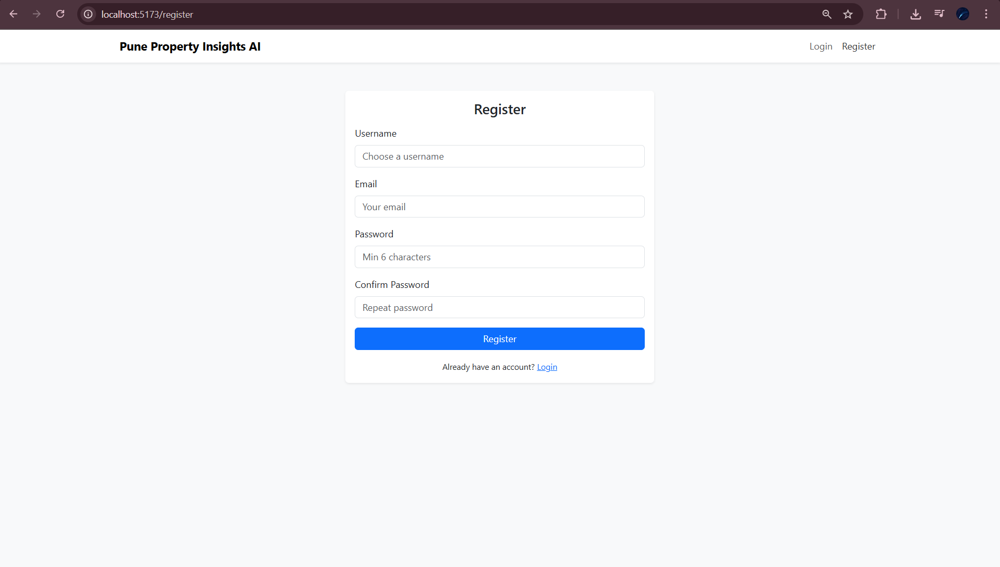
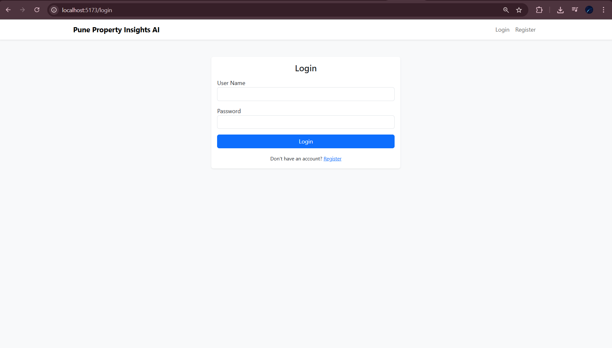
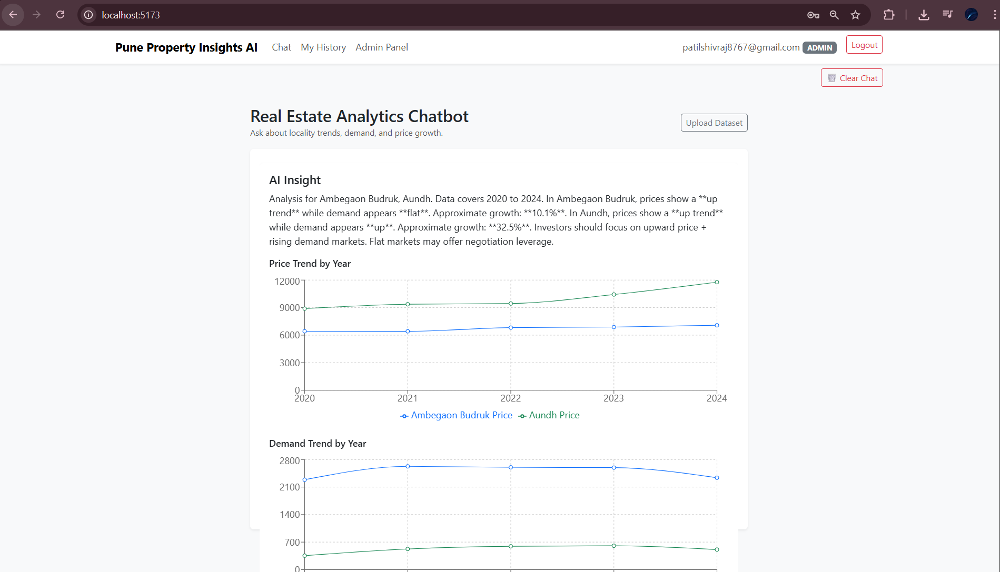
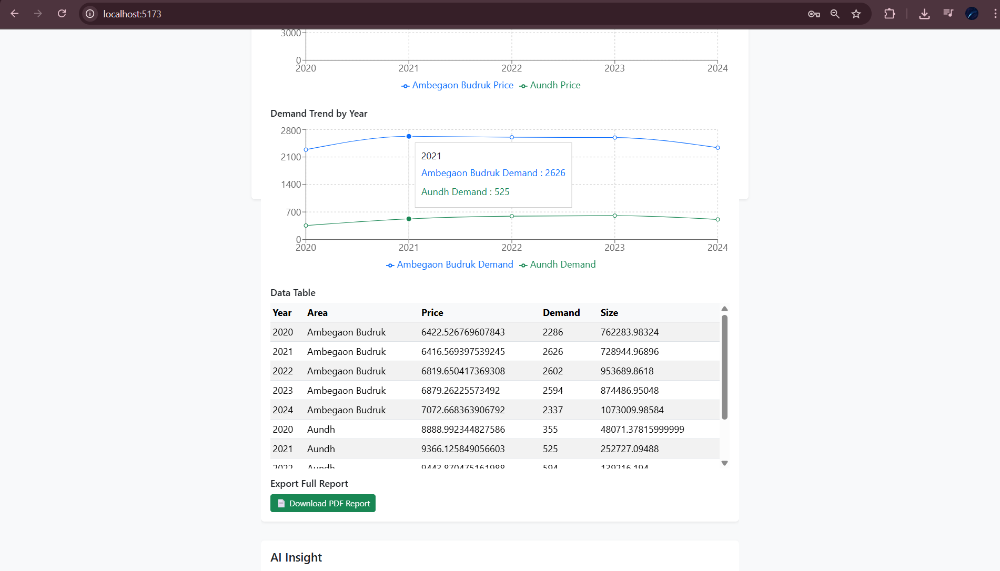
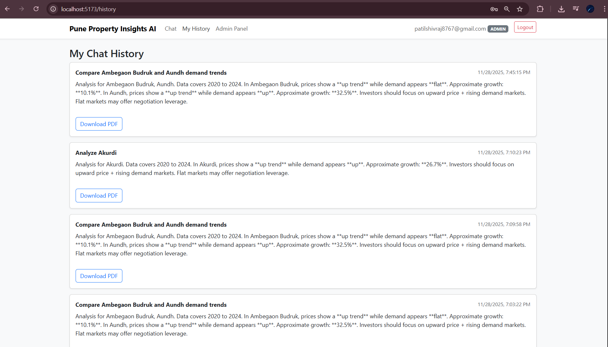
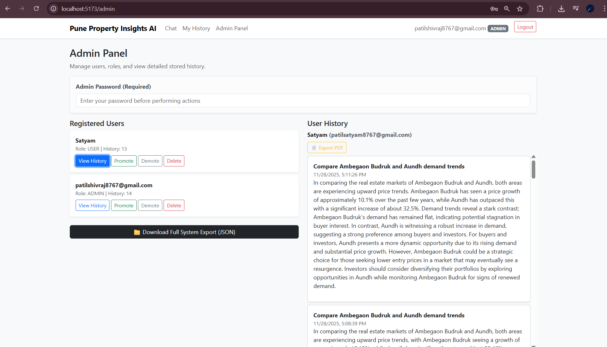

# RealEstateAnalyticsApp

## Key Features

1) Natural language understanding

2) AI-generated market summaries

3) Interactive charts (Price & Demand Trends)

4) Persisted chat history

5) Dataset upload support (Admin only)

6) Downloadable reports (PDF/CSV/Excel/JSON)

7) Role-based authentication (User/Admin)

8) Modern chat UI with memory

## Tech Stack

1) Backend: Django REST Framework, JWT Auth

2) Frontend: React, Recharts, Axios, Bootstrap

3) AI Layer: OpenAI for summarization

4) Database: SQLite (local) / PostgreSQL (for deployment)

SignUp

SignIn

Dashboard1

Dashboard2

User chat History

Admin

## Installation & Setup

1) Clone the repository

git clone https://github.com/Shivp45/real-estate-ai-analytics.git

cd RealEstateAnalyticsApp

2) Backend Setup (Django)

cd backend

python -m venv venv

venv\Scripts\activate        # On Mac/Linux: source venv/bin/activate

pip install -r requirements.txt

## Create .env inside /backend:

OPENAI_API_KEY=your_key_here

SECRET_KEY=your_secret_here

DEBUG=True

## Run migrations and start server:

1) python manage.py migrate

2) python manage.py runserver

## Backend runs at:

 http://127.0.0.1:8000

3) Frontend Setup (React)

1) cd ../frontend

2) npm install

3) npm run dev

## Frontend runs at:

 http://localhost:5173

## Login / Admin

Register normally through the UI

Make the first user an Admin manually via Django Admin:

=> python manage.py createsuperuser

Then edit their role to ADMIN in the database or UI.

